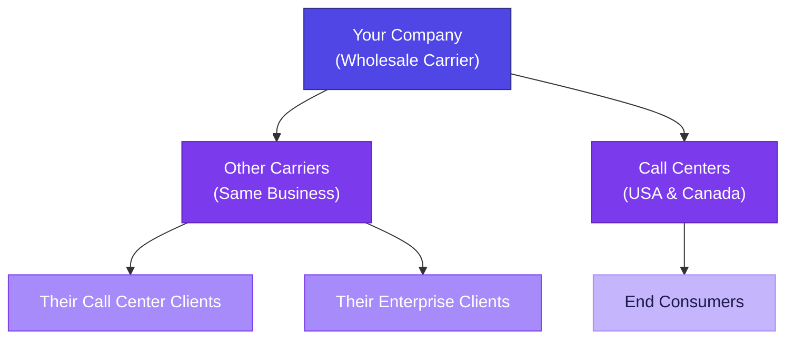
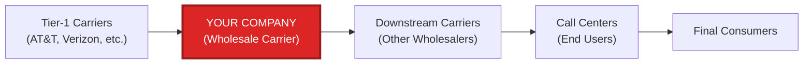

# Company Analysis & Sales Lead Generation Research

---

## Part 1: Company Business Model Analysis

Based on the transcribed audio, here is a structured breakdown of your company's identity, products, market positioning, and target audience.

---

### 🏢 Company Identity

| Attribute | Detail |
|---|---|
| **Industry** | Wholesale Telecommunications / VoIP |
| **Business Model** | Carrier-to-Carrier (C2C) — Wholesale |
| **Position in Chain** | Intermediate provider (between upstream carriers and downstream carriers/call centers) |
| **NOT** | Retail / End-user facing |

> [!IMPORTANT]
> Your company does **not** sell to end users (individual consumers or call centers directly). You operate in the **wholesale layer**, providing voice termination and origination services to other carriers and telecom service providers who in turn serve their own customers.

---

### 📦 Product Lines

Your company offers **two core products**:

#### 1. Outbound Product (Primary Revenue Driver)
- **Definition**: Providing voice routes for entities **outside a country** to make calls **into** that country
- **Example from transcription**: *"If someone in America calls people within America, we provide an outbound system for them"*
- **How it works**: You provide voice termination capacity to international carriers/call centers that need to connect calls to destinations inside the US, Canada, or other target countries
- **Key use case**: A call center in India uses your routes to terminate calls to US phone numbers

#### 2. Inbound Product
- **Definition**: Calls originating and terminating **within the same country**
- **Example from transcription**: *"Inside, a call is happening within the country. In India, calls from Indian numbers to other Indian numbers are part of an inbound system"*
- **How it works**: Domestic call routing — providing voice capacity for in-country call traffic

---

### 📡 Route Types Offered

| Route Type | Full Name | Description | Use Case |
|---|---|---|---|
| **CLI** | Caller Line Identification | The **actual caller's number is displayed** on the recipient's screen | Premium routes — used when caller identity must be authentic (e.g., enterprise calls, verified business communications) |
| **Non-CLI** | Non Caller Line Identification | A **masked/different number** is displayed instead of the real one | Cost-effective routes — used when caller identity display is not required |
| **CC** | Call Center routes | Used for **random telephone systems** — hospitals, companies, hotel PBX systems | Automated or system-generated calls where specific CLI is not important |

> [!NOTE]
> CLI routes are typically **more expensive** and **higher quality** because they preserve caller identity — crucial for compliance with STIR/SHAKEN and regulatory frameworks in the US/Canada. Non-CLI and CC routes are cheaper but face more scrutiny.

---

### 🎯 Target Market



| Target Segment | Details |
|---|---|
| **Primary Customers** | Other wholesale carriers (carrier-to-carrier business) |
| **Secondary Customers** | Call centers in USA & Canada |
| **Geographic Focus** | USA and Canada (primary), India (domestic inbound) |
| **Verticals Served** | Hotels (testing/PBX integration), Medical/Healthcare support |
| **NOT targeting** | Individual consumers, small businesses, retail VoIP users |

---

### 🔄 Value Chain Position



Your company sits in the **middle of the value chain** — buying capacity from upstream providers and selling it downstream to other carriers and large-volume users.

---

### 💡 Key Takeaways from the Audio

1. **Wholesale-only model** — you don't interact with the person making or receiving the call
2. **Carrier-to-carrier focus** — your customers are in the same business as you
3. **Compliance-aware** — offering both CLI (transparent) and Non-CLI (masked) routes shows awareness of regulatory requirements
4. **Sector specialization** — hotels and medical support suggest niche expertise in specific PBX/system integrations
5. **Testing services** — you offer route testing (checking if calls go through) which is a value-add for hotel/medical clients

---

---

## Part 2: Deep Research — Platforms & Approaches for Genuine Contact Acquisition

Below is a comprehensive research report on **every viable platform, database, community, and strategy** your sales team can use to find genuine carrier-level contacts. This goes well beyond Apollo and the Robocall Mitigation Database.

---

### 📊 Category 1: Government & Regulatory Databases (FREE — High Quality)

These are **official, publicly accessible databases** maintained by regulatory bodies. Every voice service provider in the US/Canada is legally required to be listed. This makes them **gold mines for genuine contacts**.

#### 1.1 FCC Robocall Mitigation Database (RMD)
| Detail | Info |
|---|---|
| **URL** | [fccprod.servicenowservices.com/rmd](https://fccprod.servicenowservices.com/rmd) |
| **Cost** | FREE |
| **What you get** | Company name, STIR/SHAKEN status, robocall mitigation plan, **contact person** for the company's telecom compliance team |
| **Why it's valuable** | Every voice service provider in the US MUST be listed here. Non-listed providers are **legally blocked** from sending traffic. The contact info is for the person responsible for interconnection — exactly who you want to reach |
| **How to use** | Download the full CSV → filter by provider type → extract contact emails & phone numbers → cross-reference with LinkedIn |
| **API available** | Yes — you can build automated pipelines to pull data |

> [!TIP]
> The RMD contact person is typically the VP of Interconnect, Director of Carrier Relations, or Head of Wholesale — exactly the decision-maker you need.

#### 1.2 FCC Form 499-A Filer Database
| Detail | Info |
|---|---|
| **URL** | [apps.fcc.gov/cgb/form499/499a.cfm](https://apps.fcc.gov/cgb/form499/499a.cfm) |
| **Cost** | FREE |
| **What you get** | Legal name, DBA names, business addresses, service types (Interconnected VoIP, CLEC, Wireless, etc.), service areas by state, **company officer contacts**, customer inquiry contacts |
| **Why it's valuable** | This is the **master registry** of all telecom providers in the US. You can filter by "Interconnected VoIP" to find every VoIP carrier operating in the country |
| **Search tip** | Use wildcard `%` around search terms (e.g., `%VoIP%`) for broader results. You can also download the full Excel dump |

#### 1.3 FCC ULS (Universal Licensing System)
| Detail | Info |
|---|---|
| **URL** | [wireless.fcc.gov/uls](https://wireless.fcc.gov/uls) |
| **Cost** | FREE |
| **What you get** | Licensed carriers, contact info for license holders |
| **Why it's valuable** | Useful for identifying smaller carriers that may not appear in larger databases |

#### 1.4 CRTC Telecom Provider List (Canada)
| Detail | Info |
|---|---|
| **URL** | [crtc.gc.ca/eng/comm/telecom.htm](https://crtc.gc.ca/eng/comm/telecom.htm) |
| **Cost** | FREE |
| **What you get** | List of all registered telecom providers in Canada |
| **Why it's valuable** | Since your target market includes Canada, this is the Canadian equivalent of the FCC databases |

---

### 🏛️ Category 2: Industry Conferences & Events (HIGHEST ROI for Carrier Deals)

> [!IMPORTANT]
> In the wholesale telecom world, **80%+ of deals happen through face-to-face meetings at industry events**. These are not optional — they are the #1 channel for genuine carrier partnerships.

#### 2.1 Must-Attend Events

| Event | Focus | When | Where | Why Attend |
|---|---|---|---|---|
| **International Telecoms Week (ITW)** | The **#1** global wholesale telecom event | May 18-21, 2026 | National Harbor, MD (near Washington DC) | The single most important event for carrier-to-carrier deals. Pre-scheduled 1:1 meetings with carriers |
| **Wholesale World Congress (WWC)** | Dedicated wholesale telecom networking | Periodic (check schedule) | Madrid / rotating | Highly structured around commercial deal-making for Tier 1-3 carriers |
| **Americas Wholesale Congress (AWC)** | Americas-focused wholesale | Annual | Americas region | Perfect for your USA/Canada focus — smaller, more targeted than ITW |
| **Capacity Europe** | European connectivity + Voice & Messaging track | Sep/Oct annually | London area | Has a dedicated Voice & Messaging track with wholesale carrier attendees |
| **GCCM Series (Carrier Community)** | Regional carrier networking | Multiple per year | Dubai, Berlin, various | Highly networking-focused. Smaller groups = more meaningful connections |
| **MMS 2026 (Mobile & Messaging Summit)** | Mobile, messaging, voice | Jun 15-18, 2026 | Berlin | Good for SMS and voice wholesale contacts |
| **MWC Barcelona** | Entire telecom industry | Mar 2-5, 2026 | Barcelona, Spain | Massive event — good for strategic partnerships, less for pure wholesale voice deals |

> [!TIP]
> **Pro Strategy for Events:**
> 1. Register early — meeting scheduler apps open weeks in advance
> 2. Use the event's proprietary app to pre-schedule 15-20 meetings per day
> 3. Collect business cards → enter into CRM within 24 hours
> 4. Send follow-up emails within 48 hours while the connection is fresh
> 5. Attend the networking dinners/cocktails — most real deals happen informally

---

### 🌐 Category 3: Industry Associations & Membership Organizations

Join these to get access to **member directories, private networking, and credibility signals**.

#### 3.1 Carrier Community (CC)
| Detail | Info |
|---|---|
| **URL** | [carriercommunity.com](https://carriercommunity.com) |
| **Cost** | Membership-based |
| **What you get** | Access to a global club of thousands of wholesale telecom members (C-level, VPs, managers), member directory, event invitations, GCCM meeting access |
| **Segments covered** | Voice, SMS, Data, Cloud, Mobile, OTT, Data Centers |
| **Why join** | Direct access to carrier decision-makers + credibility as a legitimate wholesale player |

#### 3.2 i3forum
| Detail | Info |
|---|---|
| **URL** | [i3forum.org](https://i3forum.org) |
| **Cost** | Membership-based |
| **What you get** | Participation in work groups (Voice, Fraud, Technology), networking with international carriers, industry credibility |
| **Key initiative** | "Restore Trust" — if you participate, you demonstrate compliance, which is attractive to US/Canadian buyers |
| **Why join** | Positions you as a **trusted, fraud-aware carrier** — this is a major selling point |

#### 3.3 ITW Global Leaders' Forum (GLF)
| Detail | Info |
|---|---|
| **What it is** | A group of senior leaders from international carriers working on codes of conduct |
| **Why it matters** | Being associated with GLF demonstrates commitment to industry standards — a trust signal for potential customers |

#### 3.4 INCOMPAS (USA)
| Detail | Info |
|---|---|
| **URL** | [incompas.org](https://incompas.org) |
| **What it is** | The leading US trade association for competitive telecom providers |
| **What you get** | Member directory, lobbying updates, networking events |
| **Why join** | Access to US CLECs and competitive carriers who are potential customers |

---

### 🖥️ Category 4: VoIP Route Exchange & Trading Platforms

These are **online marketplaces** where carriers actively buy and sell voice traffic. Your potential customers are already here looking for routes.

#### 4.1 RouteCall
| Detail | Info |
|---|---|
| **URL** | [routecall.com](https://routecall.com) |
| **What it is** | Online trading system for VoIP traffic — members anonymously trade routes |
| **Why it's valuable** | Carriers actively looking to buy routes are here. You can list your CLI/Non-CLI/CC routes and get inbound inquiries |

#### 4.2 Telcobridges / Various Rate Deck Exchanges
| Detail | Info |
|---|---|
| **What they are** | Platforms where carriers publish rate decks (pricing for terminating calls to specific destinations) |
| **How to use** | Publish your competitive rate decks → carriers interested in your destinations will contact you |

#### 4.3 Carrier Trading Portals (Direct Interconnect)
| Platforms/Providers | |
|---|---|
| **Telnyx** | API-first platform — list your routes and capacity |
| **Flowroute** | Real-time route management and trading |
| **Acepeak** | AI-driven wholesale voice and SMS marketplace |
| **IDT Express** | Major global wholesale carrier — both a competitor and potential partner |

> [!NOTE]
> Even if you compete with some of these platforms, many carriers buy from multiple sources for redundancy. Don't treat competitors as enemies — they can be partners for specific destinations.

---

### 🔍 Category 5: B2B Sales Intelligence Tools

These tools help you find **decision-maker contact details** (emails, phone numbers, LinkedIn profiles) at target companies.

| Tool | What It Does | Best For | Pricing |
|---|---|---|---|
| **Apollo.io** | Contact database + email sequencing + lead scoring | Finding wholesale carrier decision-makers en masse | Free tier available, paid from ~$49/mo |
| **ZoomInfo** | Enterprise-grade B2B data platform with org charts, direct dials, verified emails | Finding exact decision-makers at specific carriers | Premium ($$$) — but highest data quality |
| **Lusha** | Browser extension to find contact details on LinkedIn profiles | Quick lookup of specific people you find at events/conferences | Free tier + paid from ~$29/mo |
| **Hunter.io** | Email finder & verifier — finds email patterns for any domain | Finding email addresses when you know the company domain | Free tier + paid from ~$49/mo |
| **Seamless.ai** | Real-time contact data with AI-powered search | Building large lists of telecom decision-makers | Paid plans |
| **RocketReach** | Find emails, phone numbers, social links for professionals | Cross-referencing contacts found in regulatory databases | Free tier + paid |
| **Cognism** | GDPR-compliant B2B data with verified phone numbers | European/international carrier contacts | Paid |
| **Clearbit** | Company enrichment + contact data + intent signals | Understanding which carriers are actively looking for new routes | Paid |

> [!TIP]
> **Optimal Stack for Your Business:**
> - **Apollo.io** for mass prospecting and email sequences
> - **Lusha** browser extension for real-time LinkedIn lookups
> - **Hunter.io** for email verification before sending
> - **ZoomInfo** if budget allows — best for telecom-specific data

---

### 💼 Category 6: LinkedIn Strategies (Beyond Basic Search)

LinkedIn is not just a database — it's an **active engagement platform**. Here's how to use it specifically for wholesale telecom.

#### 6.1 LinkedIn Sales Navigator
| Strategy | Details |
|---|---|
| **Account Filters** | Industry: Telecommunications, IT Services → Geography: USA, Canada → Keywords: "VoIP," "Wholesale," "SIP Trunking," "Telecom Carrier" |
| **Lead Filters** | Title: "VP of Sales," "Head of Wholesale," "Carrier Relations Manager," "Director of Interconnect," "Director of Product" → Seniority: Director, VP, CXO |
| **Pro Tip** | Filter "Years in Current Role: 0-1 years" — people new to a role are more open to new partnerships |
| **Signals** | Monitor job changes, company growth, and recent posts for outreach timing |

#### 6.2 LinkedIn Content Strategy (Inbound Leads)
| Action | What To Do |
|---|---|
| **Post regularly** | Share insights about route quality, CLI vs Non-CLI, industry compliance updates |
| **Comment strategically** | Engage meaningfully on posts by carrier executives (not "great post!" — add real value) |
| **Join LinkedIn Groups** | "VoIP Community," "Wholesale Telecom Professionals," "Call Center Executives" |
| **Publish articles** | Write about STIR/SHAKEN compliance, route quality metrics (ASR/ACD), industry trends |

#### 6.3 LinkedIn Boolean Search (Free Alternative)
Use this search string in LinkedIn's regular search bar:
```
("wholesale VoIP" OR "voice termination" OR "carrier sales" OR "interconnect") AND ("director" OR "VP" OR "head") AND ("USA" OR "Canada")
```

---

### 📱 Category 7: Online Communities & Informal Channels

These are **informal but highly active** channels where carrier deals happen daily.

#### 7.1 Telegram/WhatsApp Groups
| Channel Type | How to Find |
|---|---|
| **Wholesale VoIP Groups** | Search Telegram for "Wholesale VoIP," "VoIP Routes," "Carrier Exchange" |
| **Rate Deck Exchange Groups** | Carriers share rate decks and route availability in real-time |
| **How to join** | Usually by invitation — attend one GCCM event and you'll be added to multiple groups |
| **Caution** | Verify legitimacy of contacts. Many scammers operate in these groups |

#### 7.2 Specialized Forums & Communities
| Platform | Details |
|---|---|
| **DSLReports / Broadband Reports** | Forums with carrier professionals discussing routing, quality, and partnerships |
| **VoIP-Info.org** | Wiki + community for VoIP professionals |
| **Reddit: r/VoIP, r/telecom** | Active communities — useful for awareness building and identifying potential leads |
| **Quora** | Answer questions about wholesale VoIP to build authority and attract inbound leads |

#### 7.3 Skype Groups (Legacy but Active)
| Detail | Info |
|---|---|
| **What** | Many old-school wholesale VoIP dealers still use Skype group chats for real-time deal-making |
| **How to access** | Ask contacts at industry events — many groups are invitation-only |

---

### 🧠 Category 8: Unique & Advanced Approaches

These are **unconventional strategies** that most of your competitors are NOT using.

#### 8.1 Reverse-Engineer Competitor Partnerships
| Step | Action |
|---|---|
| 1 | Identify your top 5 competitors (other wholesale carriers in your space) |
| 2 | Look at their "Partners" or "Carrier" pages on their websites |
| 3 | Those listed partners are carriers who are **already buying wholesale voice** — they are your perfect targets |
| 4 | Use Apollo/ZoomInfo to find decision-maker contacts at those companies |

#### 8.2 STIR/SHAKEN Compliance as a Sales Angle
| Strategy | Details |
|---|---|
| **What** | Many carriers struggle with STIR/SHAKEN compliance. If you offer fully attested CLI routes (A-level attestation), this is a **massive selling point** |
| **How** | Create content around your compliance → share on LinkedIn → carriers searching for compliant routes will find you |
| **Who to target** | Search the RMD for providers with "Robocall Mitigation Plan" (not full STIR/SHAKEN) — they need compliant upstream carriers |

#### 8.3 FCC Public Notices & Proceedings
| Strategy | Details |
|---|---|
| **What** | The FCC publishes public notices about new carrier licenses, mergers, and compliance actions |
| **URL** | [fcc.gov/public-notices](https://www.fcc.gov/document/public-notices) |
| **How to use** | Monitor for newly licensed carriers — they need interconnection partners immediately |
| **Automation** | Set up Google Alerts for "FCC" + "voice service provider" + "license" |

#### 8.4 PeeringDB (For Technical Interconnection)
| Detail | Info |
|---|---|
| **URL** | [peeringdb.com](https://peeringdb.com) |
| **What** | Database of networks willing to peer/interconnect |
| **Why** | Find carriers with existing infrastructure in your target regions — they're technically capable of receiving your traffic |

#### 8.5 Job Board Mining
| Strategy | Details |
|---|---|
| **What** | Search job boards (LinkedIn, Indeed) for "wholesale voice" or "carrier relations" job postings |
| **Why** | If a company is **hiring** for wholesale/carrier positions, they are **actively expanding** their interconnect partnerships — perfect timing to reach out |
| **Bonus** | The job description often reveals who they currently partner with and what routes they need |

#### 8.6 Intent Data & Technographics
| Tool | What It Does |
|---|---|
| **Bombora** | Tracks which companies are actively researching "wholesale VoIP" or "voice termination" online |
| **G2 / TrustRadius** | Shows which companies are evaluating wholesale voice solutions |
| **BuiltWith** | Identify what telecom technology stack a company uses — helps you tailor your pitch |

#### 8.7 Webinars & Thought Leadership
| Strategy | Details |
|---|---|
| **Host webinars** | Topics like "CLI Route Quality in 2026" or "STIR/SHAKEN Best Practices for Wholesale Carriers" |
| **Why** | Attendees are self-qualified leads — they attend because they're in the market |
| **Registration = Contact info** | Every registrant gives you their email and company name |

#### 8.8 Industry Publications & Advertising
| Publication | Details |
|---|---|
| **Comms Business** | Trade publication for wholesale telecom |
| **Capacity Media** | Publisher behind Capacity Europe events — their newsletters reach carrier executives |
| **Light Reading** | Telecom industry news — sponsored content/ads reach decision-makers |
| **TeleGeography** | Research firm — their reports are read by every major carrier |
| **CommsUpdate** | Daily telecom news — advertising here puts you in front of carriers |

---

## 📋 Priority Action Plan

Here's a recommended execution order based on **cost, effort, and expected ROI**:

| Priority | Action | Cost | Effort | Expected ROI |
|---|---|---|---|---|
| 🔴 **1** | Download & mine the FCC RMD + 499A databases | FREE | Low | Very High |
| 🔴 **2** | Set up LinkedIn Sales Navigator with telecom filters | ~$99/mo | Medium | Very High |
| 🔴 **3** | Register for ITW 2026 (May 18-21) | ~$2,000-5,000 | High | Highest |
| 🟡 **4** | Join Carrier Community (carriercommunity.com) | Membership fee | Low | High |
| 🟡 **5** | Set up Apollo.io for automated email outreach | Free/$49/mo | Medium | High |
| 🟡 **6** | Create LinkedIn content strategy (2 posts/week) | FREE | Medium | Medium-High |
| 🟡 **7** | List routes on RouteCall and exchange platforms | Variable | Low | Medium |
| 🟢 **8** | Join i3forum for credibility + networking | Membership fee | Low | Medium |
| 🟢 **9** | Set up Google Alerts for FCC new licenses | FREE | Very Low | Medium |
| 🟢 **10** | Monitor job boards for expansion signals | FREE | Low | Medium |
| 🟢 **11** | Host a quarterly webinar | ~$500/event | Medium | Medium |
| 🟢 **12** | Explore ZoomInfo for high-value contact data | $$$ | Low | High (if budget allows) |

---

> [!CAUTION]
> **Compliance Warning**: When reaching out to contacts, especially in the US/Canada:
> - Follow CAN-SPAM Act rules for email outreach
> - Do NOT use your own routes for cold calling (potential TCPA violations)
> - Always verify contacts before adding to outreach sequences
> - Maintain opt-out mechanisms in all communications
> - Document consent for all contacts in your CRM
