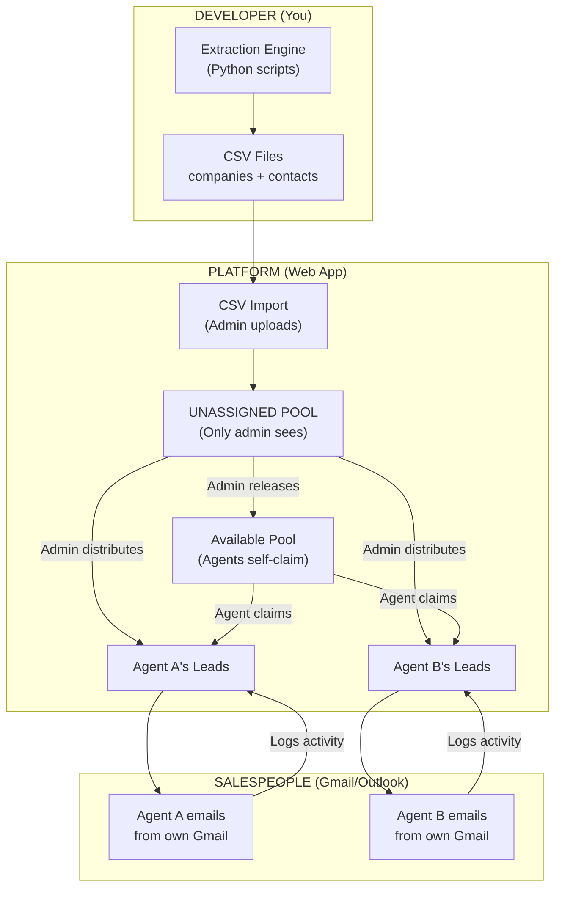

# Sales Lead Platform — Final Implementation Plan

## Confirmed Requirements

| Question | Answer |
|---|---|
| Team size | **15-20 salespeople** + 1 admin |
| Hosting | **Your machine** for now, migrate to cloud later |
| Email sending | **NOT built in** — agents use their own Gmail/Outlook |
| Claim limits | **Admin decides** per-agent limits |
| Data pipeline | **Developer runs extraction** → imports CSV → **Sales admin distributes** |

---

## System Architecture



### Three Roles

| Role | Can Do | Cannot Do |
|---|---|---|
| **Developer** | Run extraction scripts, generate CSVs | Access the sales platform |
| **Sales Admin** | Import CSVs, see ALL leads, distribute leads, manage agents, set limits, view stats, reassign/reclaim | — |
| **Sales Agent** | See ONLY their assigned leads, claim from available pool, log outreach activity, update status | See other agents' leads, import data, manage users |

---

## Tech Stack

| Component | Technology | Why |
|---|---|---|
| Backend | **Python + FastAPI** | You know Python. FastAPI handles 20 concurrent users easily |
| Database | **SQLite** | Zero setup, single file. Handles 20 users fine. Migrate to PostgreSQL when moving to cloud |
| Frontend | **HTML + CSS + JavaScript** | No framework needed. Clean, fast, works in any browser |
| Auth | **JWT tokens + bcrypt passwords** | Secure, stateless, standard |
| Server | **Uvicorn** | `python main.py` → runs at `http://your-ip:8000` |

### Project Structure
```
kimi/sales_platform/
├── main.py                 # FastAPI app entry point
├── database.py             # SQLite setup + queries
├── auth.py                 # Login, JWT, password hashing
├── routes/
│   ├── auth_routes.py      # POST /login
│   ├── agent_routes.py     # GET /my-leads, POST /claim, POST /activity
│   └── admin_routes.py     # GET /all-leads, POST /assign, POST /import
├── static/
│   ├── css/
│   │   └── styles.css      # All styling
│   ├── js/
│   │   ├── app.js          # Main app logic
│   │   ├── dashboard.js    # Dashboard page
│   │   ├── profile.js      # Company profile page
│   │   └── admin.js        # Admin panel logic
│   └── index.html          # Single page app shell
├── templates/              # HTML templates (if using server-side rendering)
├── data/
│   └── leads.db            # SQLite database file
└── README.md
```

---

## Database Schema (6 Tables)

### users
```sql
CREATE TABLE users (
    id INTEGER PRIMARY KEY AUTOINCREMENT,
    username TEXT UNIQUE NOT NULL,
    password_hash TEXT NOT NULL,
    full_name TEXT NOT NULL,
    role TEXT DEFAULT 'agent',          -- 'admin' or 'agent'
    max_leads INTEGER DEFAULT 50,       -- claim limit (admin sets this)
    is_active BOOLEAN DEFAULT 1,
    created_at DATETIME DEFAULT CURRENT_TIMESTAMP
);
```

### companies
```sql
CREATE TABLE companies (
    id INTEGER PRIMARY KEY AUTOINCREMENT,
    company_name TEXT NOT NULL,
    company_domain TEXT,
    company_type TEXT,                  -- Carrier / ITSP / CLEC / IXC / Call Center
    company_size TEXT,
    country TEXT,
    state TEXT,
    address TEXT,
    about TEXT,                         -- for email drafting context
    services TEXT,                      -- VoIP, SIP, SMS, DID
    tech_stack TEXT,                     -- VOS3000, PortaSwitch, etc.
    source TEXT,                        -- FCC_499A / CRTC / TCXC / Event
    fcc_filer_id TEXT,
    website_url TEXT,
    linkedin_company_url TEXT,
    created_at DATETIME DEFAULT CURRENT_TIMESTAMP
);
```

### contacts
```sql
CREATE TABLE contacts (
    id INTEGER PRIMARY KEY AUTOINCREMENT,
    company_id INTEGER REFERENCES companies(id),
    full_name TEXT,
    job_title TEXT,
    seniority TEXT,                     -- C-Level / VP / Director / Manager
    email TEXT,
    email_verified BOOLEAN DEFAULT 0,
    email_confidence INTEGER DEFAULT 0,
    phone TEXT,
    linkedin_url TEXT,
    linkedin_search_url TEXT,           -- auto-generated
    source TEXT,                        -- Apollo / Hunter / FCC / Manual
    source_count INTEGER DEFAULT 1,
    lead_score INTEGER DEFAULT 0,
    tier TEXT DEFAULT 'C',              -- A / B / C
    -- Assignment
    status TEXT DEFAULT 'unassigned',   -- unassigned / available / assigned
    assigned_to INTEGER REFERENCES users(id),
    assigned_by INTEGER REFERENCES users(id),
    assigned_at DATETIME,
    assignment_mode TEXT,               -- admin_distributed / self_claimed
    -- Outreach
    outreach_status TEXT DEFAULT 'new', -- new / contacted / replied / meeting / won / lost
    last_contacted_at DATETIME,
    notes TEXT,
    created_at DATETIME DEFAULT CURRENT_TIMESTAMP,
    updated_at DATETIME DEFAULT CURRENT_TIMESTAMP
);
```

### signals
```sql
CREATE TABLE signals (
    id INTEGER PRIMARY KEY AUTOINCREMENT,
    company_id INTEGER REFERENCES companies(id),
    signal_type TEXT,                   -- job_posting / event / fcc_new / competitor_partner
    signal_detail TEXT,
    detected_at DATETIME DEFAULT CURRENT_TIMESTAMP,
    points INTEGER DEFAULT 0
);
```

### activities
```sql
CREATE TABLE activities (
    id INTEGER PRIMARY KEY AUTOINCREMENT,
    contact_id INTEGER REFERENCES contacts(id),
    user_id INTEGER REFERENCES users(id),
    channel TEXT,                       -- email / linkedin / phone / meeting
    action TEXT,                        -- sent / replied / bounced / call_made / meeting_set
    subject TEXT,
    body TEXT,                          -- notes about the interaction
    created_at DATETIME DEFAULT CURRENT_TIMESTAMP
);
```

### import_logs
```sql
CREATE TABLE import_logs (
    id INTEGER PRIMARY KEY AUTOINCREMENT,
    filename TEXT,
    total_rows INTEGER,
    new_companies INTEGER,
    new_contacts INTEGER,
    duplicates_skipped INTEGER,
    imported_by INTEGER REFERENCES users(id),
    imported_at DATETIME DEFAULT CURRENT_TIMESTAMP
);
```

---

## CSV Import Format

Developer exports this from extraction engine. Admin uploads it to the platform.

**Columns (20, in order, matching `lead_engine/export/csv_exporter.py`):**
`company_name, company_domain, company_type, country, state, about, services, tech_stack, source, contact_name, job_title, seniority, email, email_verified, email_confidence, phone, linkedin_url, linkedin_search_url, lead_score, tier`

```csv
company_name,company_domain,company_type,country,state,about,services,tech_stack,source,contact_name,job_title,seniority,email,email_verified,email_confidence,phone,linkedin_url,linkedin_search_url,lead_score,tier
"Acme Telecom","acmetelecom.com","IXC","USA","TX","Wholesale voice carrier...","VoIP Termination, SIP","VOS3000","FCC_499A","John Smith","VP Wholesale","VP","john@acmetelecom.com",1,92,"+1-555-123","linkedin.com/in/jsmith","",87,"A"
```

**On import, the system:**
1. Checks if company already exists (by domain) → updates if exists, creates if new
2. Checks if contact already exists (by email) → skips duplicates
3. Stores `linkedin_search_url` if provided; otherwise auto-generates one for contacts without a LinkedIn profile
4. Logs import stats (new vs duplicate)
5. All imported leads go to **UNASSIGNED POOL**

---

## Pages (5 Total)

### Page 1: Login
- Username + password
- Admin creates all accounts (no self-registration)
- Redirects to Agent Dashboard or Admin Dashboard based on role

### Page 2: Agent Dashboard
- **Stats bar:** My Leads count | Contacted | Replied | Available to Claim
- **"My Leads" tab:** Table of assigned leads with full details (company, contact, email, score, tier, outreach status). Clicking a row → opens Company Profile
- **"Available Pool" tab:** Leads released by admin. Shows ONLY company name, country, score, tier. Emails/phones/details HIDDEN. Agent clicks [Claim] → lead moves to their "My Leads" with full details

### Page 3: Company Profile (Detail View)
- Company header: name, type, country, size, website, FCC ID
- About section: company description, services, tech stack
- Contacts table: name, title, email (with verified badge), phone, LinkedIn link
- Signals: why this lead scored high (FCC source, Apollo match, job posting, event)
- Outreach history: every email/call/meeting logged by the assigned agent
- Action buttons: [Log Activity] [Add Note] [Update Status dropdown]

### Page 4: Admin — Lead Distribution
- **Unassigned Pool** table with checkboxes for bulk selection
- **"Assign to [Agent ▼]"** button → assigns selected leads to chosen agent
- **"Release to Available Pool"** button → makes leads claimable
- **Agent overview** table: agent name | assigned count | contacted | replied | reply%
- **Reassign/Reclaim** buttons per lead
- **Per-agent claim limit** setting

### Page 5: Admin — Settings & Users
- Create/edit/deactivate agent accounts
- Set claim limits per agent
- Import CSV (upload + preview + confirm)
- Import history log
- Stale lead rules (auto-reclaim after X days of inactivity)

---

## API Endpoints (18 Total)

### Auth
| Method | Endpoint | Access | Purpose |
|---|---|---|---|
| POST | `/api/login` | Public | Login → JWT token |

### Agent Endpoints
| Method | Endpoint | Access | Purpose |
|---|---|---|---|
| GET | `/api/leads/my` | Agent | Get only my assigned leads |
| GET | `/api/leads/available` | Agent | Available pool (limited fields) |
| GET | `/api/leads/{id}` | Agent (own) | Full company profile (only if assigned to you) |
| POST | `/api/leads/{id}/claim` | Agent | Claim from available pool |
| POST | `/api/activities` | Agent | Log outreach (email sent, call, etc.) |
| PUT | `/api/leads/{id}/status` | Agent (own) | Update outreach status |
| GET | `/api/me/stats` | Agent | My personal stats |

### Admin Endpoints
| Method | Endpoint | Access | Purpose |
|---|---|---|---|
| GET | `/api/admin/leads` | Admin | ALL leads (with filters) |
| POST | `/api/admin/leads/assign` | Admin | Bulk assign leads to agent |
| POST | `/api/admin/leads/release` | Admin | Move leads to available pool |
| POST | `/api/admin/leads/reclaim` | Admin | Take back from agent |
| POST | `/api/admin/leads/reassign` | Admin | Transfer between agents |
| POST | `/api/admin/import` | Admin | Upload + import CSV |
| GET | `/api/admin/stats` | Admin | All agents' performance |
| GET | `/api/admin/users` | Admin | List agents |
| POST | `/api/admin/users` | Admin | Create agent account |
| PUT | `/api/admin/users/{id}` | Admin | Edit agent (limit, active status) |

---

## Visibility Rules (Enforced at API Level)

```python
# Every API call checks this
def get_visible_leads(current_user):
    if current_user.role == 'admin':
        return ALL leads  # admin sees everything
    
    if current_user.role == 'agent':
        return leads WHERE assigned_to == current_user.id
        # Agent NEVER gets leads assigned to other agents
        # Not filtered out on frontend — filtered at DATABASE QUERY level
```

> [!IMPORTANT]
> Visibility is enforced at the **database query level**, not just the frontend. Even if someone inspects the API, they cannot see leads assigned to other agents. The SQL query itself filters by `assigned_to = current_user_id`.

---

## Build Phases

### Phase 1: Foundation (3-4 days)
- [ ] Project setup (FastAPI + SQLite + static files)
- [ ] Database creation (all 6 tables)
- [ ] Auth system (login, JWT, bcrypt)
- [ ] Admin: create agent accounts
- [ ] Admin: CSV import with deduplication
- [ ] Basic UI shell (login page, navigation)

### Phase 2: Lead Distribution (3-4 days)
- [ ] Admin dashboard (unassigned pool view)
- [ ] Bulk assign leads to agents
- [ ] Release leads to available pool
- [ ] Agent dashboard (my leads table)
- [ ] Available pool view (limited fields)
- [ ] Claim functionality
- [ ] Claim limit enforcement

### Phase 3: Company Profile & Activity (3-4 days)
- [ ] Company profile detail page (full view)
- [ ] Contact cards with email/phone/LinkedIn
- [ ] Auto-generated LinkedIn search URLs
- [ ] Activity logging (email sent, call, reply)
- [ ] Outreach history timeline
- [ ] Status pipeline (new → contacted → replied → meeting → won/lost)

### Phase 4: Admin Tools & Polish (3-4 days)
- [ ] Reassign / reclaim leads
- [ ] Agent performance stats
- [ ] Import history log
- [ ] Search & filters on all tables
- [ ] Stale lead auto-reclaim
- [ ] UI polish (dark theme, responsive, animations)
- [ ] Error handling & edge cases

**Total estimated time: ~2-3 weeks**

---

## What's NOT Included (Intentionally)

| Feature | Why Excluded |
|---|---|
| Email sending | Agents use own Gmail/Outlook — simpler, better deliverability |
| Extraction engine UI | Developer runs scripts separately, imports via CSV |
| Real-time notifications | Not needed for 15-20 users at this scale |
| Mobile app | Web app works on mobile browsers already |
| Multi-language | English only for now |
